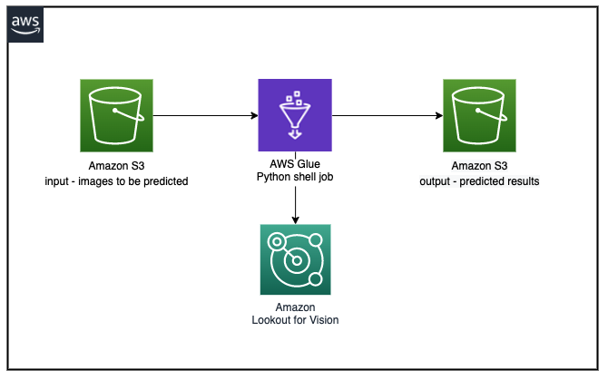
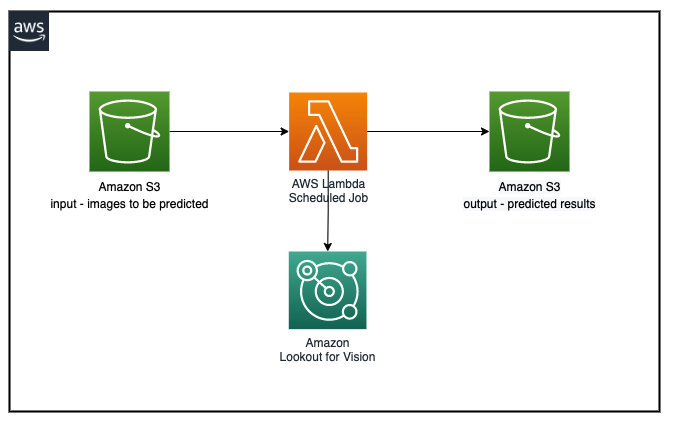

## Welcome to your CDK Python project regading the batch prediction with lookout for vision !

## General CDK setup

This is a project for Python development with CDK. The below details are overall information about any python cdk project. Below you will get a step by step option as well to use this particular cdk project.

The `cdk.json` file tells the CDK Toolkit how to execute your app.

This project is set up like a standard Python project.  The initialization
process also creates a virtualenv within this project, stored under the `.venv`
directory.  To create the virtualenv it assumes that there is a `python3`
(or `python` for Windows) executable in your path with access to the `venv`
package. If for any reason the automatic creation of the virtualenv fails,
you can create the virtualenv manually.

To manually create a virtualenv on MacOS and Linux:

```
$ python3 -m venv .venv
```

After the init process completes and the virtualenv is created, you can use the following
step to activate your virtualenv.

```
$ source .venv/bin/activate
```

If you are a Windows platform, you would activate the virtualenv like this:

```
% .venv\Scripts\activate.bat
```

Once the virtualenv is activated, you can install the required dependencies.

```
$ pip install -r requirements.txt
```

At this point you can now synthesize the CloudFormation template for this code.

```
$ cdk synth
```

To add additional dependencies, for example other CDK libraries, just add
them to your `setup.py` file and rerun the `pip install -r requirements.txt`
command.

## Useful commands

 * `cdk ls`          list all stacks in the app
 * `cdk synth`       emits the synthesized CloudFormation template
 * `cdk deploy`      deploy this stack to your default AWS account/region
 * `cdk diff`        compare deployed stack with current state
 * `cdk docs`        open CDK documentation

Enjoy!

## Step by Step

### Prerequisite

You already have one Amazon Lookout for Vision project and model in hosted status. If you don't please visit [this](https://aws.amazon.com/blogs/opensource/build-train-and-deploy-amazon-lookout-for-vision-models-using-the-python-sdk/) link in order to get started.

### Start with CDK

As outlined in the above section on CDK please follow theses steps to set this project up. Steps were:

* python3 -m venv .venv
* source .venv/bin/activate
* pip install -r requirements.txt
* cdk synth

### Configure AWS profile

You must configure your AWS profile (if not already done) with user credentials. You must have an AWS user credentials from the account where you would like to deploy this AWS CDK stack.

```
aws configure --profile <<profileName>>
AWS Access Key ID [************************]: <<Access Key>>
AWS Secret Access Key [********************]: <<Secret access key>>
Default region name []: <<YOUR_AWS_ACCOUNT_REGION>>
Default output format [None]: 
```

### Finally deploy the stack. Please replace the parameter values i.e. Amazon Lookout for Vision project name, model version and profile name as per your environment.

```
cdk bootstrap aws://<<YOUR_AWS_ACCOUNT_ID>>/<<YOUR_AWS_ACCOUNT_REGION>> --profile <<profileName>>
cdk deploy --parameters l4vProjectName=<<ProjectNameUsedToCreateThel4vModel>> --parameters l4vModelVersion=<<l4vModelVersionNumber>> --profile <<profileName>>
```

In order to check successful deployment please:

* Visit the AWS Cloudformation console on your browser and make sure that the stack with name "L4VBatchJobPredictionCdkStack" finishes in status "CREATE_COMPLETE"
* Check that there are some sample images in the input Amazon S3 bucket location below --> input-image-<<YOUR_AWS_ACCOUNT_ID>>-<<YOUR_AWS_ACCOUNT_REGION>>/inputimages/

Post deployment step:
* Please download the python .whl file (lookoutvision-0.1.10-py3-none-any.whl) of Amazon lookout for vision from the link https://pypi.org/project/lookoutvision/#files and upload that to the s3 bucket location below --> 
lookoutforvision-whlfile-<<YOUR_AWS_ACCOUNT_ID>>-<<YOUR_AWS_ACCOUNT_REGION>>


### Testing the stack

There are two main architectures created now:



and



1. Testing the AWS Glue architecture:
* In the AWS console please go to the AWS Glue and then the Workflows section. You will see a workflow has been created - "batch-prediction-workflow". [Run this workflows](https://docs.aws.amazon.com/glue/latest/dg/running_monitoring_workflow.html).
* Check the prediction results stored in the Amazon S3 bucket belowL predicted-result-<<YOUR_AWS_ACCOUNT_ID>>-<<YOUR_AWS_ACCOUNT_REGION>>/predictedresults/

**Note:** At this moment the AWS Glue workflow is in "On-Demand" mode. If required please schedule the AWS Glue workflow "batch-prediction-workflow" by scheduling the initiating trigger "trigger-l4v-batch-prediction", see also [this](https://docs.aws.amazon.com/glue/latest/dg/aws-glue-api-jobs-trigger.html#aws-glue-api-jobs-trigger-TriggerUpdate) link.

2. Testing the AWS Lambda architecture:
* In the AWS console please go to the AWS Lambda and open the function that starts with "L4VBatchJobPredictionCdkStac". Upload the input images in the below s3 bucket path
input-image-<<YOUR_AWS_ACCOUNT_ID>>-<<YOUR_AWS_ACCOUNT_REGION>>/lambdapredictinputimages/
* [Run this function.](https://docs.aws.amazon.com/lambda/latest/dg/testing-functions.html).
* Check the prediction results stored in the Amazon S3 bucket belowL predicted-result-<<YOUR_AWS_ACCOUNT_ID>>-<<YOUR_AWS_ACCOUNT_REGION>>/predictedresults/

## Security

See [CONTRIBUTING](CONTRIBUTING.md#security-issue-notifications) for more information.

## License

This library is licensed under the MIT-0 License. See the LICENSE file.

